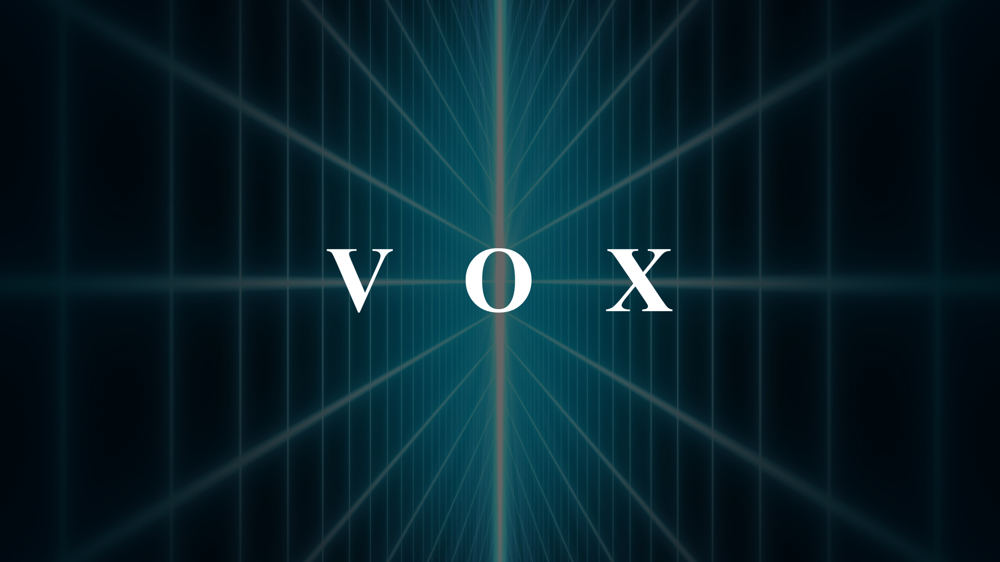

---

[vox](https://omega.gg/MotionBox) is the first video hub on the Internet. 
It's designed for a semantic player like [MotionMonkey](https://omega.gg/MotionMonkey). 
It showcases [VBML](https://omega.gg/VBML) capabilities while aggregating neat tracks. 

## Access to vox

Scan or drop this VideoTag from a [Semantic Player](https://omega.gg/about/SemanticPlayer). 
Alternatively you can enter [omega.gg/vox](https://omega.gg/vox) in its search bar.

## Feeds

- [vox progress](playlist/progress.vbml): Feed dedicated to innovation in the video streaming field.
- [vox electro](playlist/electro.vbml): Feed dedicated to electronic music and its different variations.
- [vox retro](playlist/retro.vbml): Playlist aggregating live streams from the past.

## Related projects

- [MotionBox](https://omega.gg/MotionBox/sources) - Video Browser
- [MotionMonkey](https://omega.gg/MotionMonkey) - Semantic Player
- [tevolution](https://omega.gg/tevolution) - Remote Video Screen
- [VBML](https://omega.gg/vbml) - VBML language

## Authors

- Benjamin Arnaud aka [bunjee](https://bunjee.me) | <bunjee@omega.gg>
